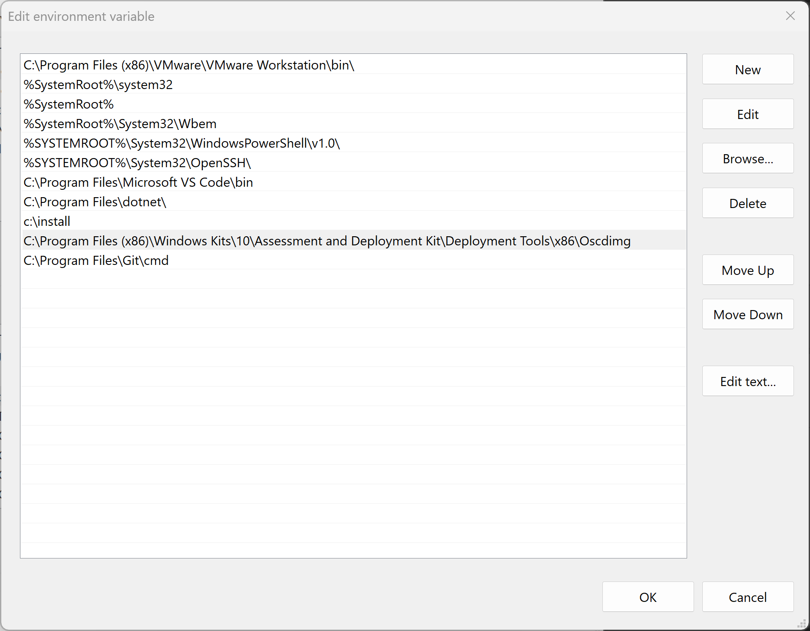
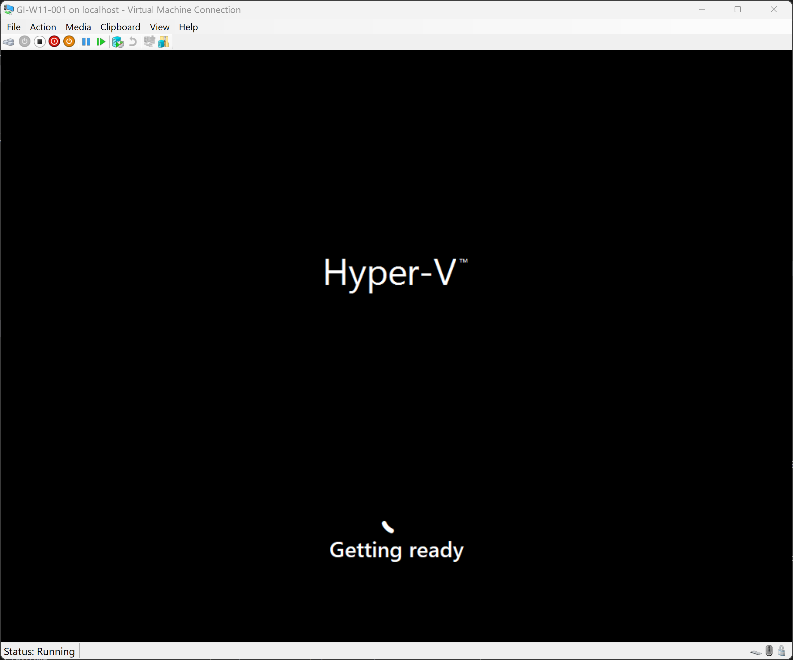
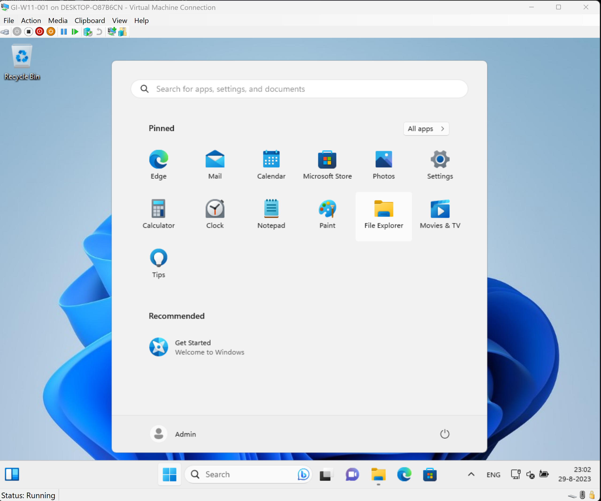

# Create a Windows 11 VM in Hyper-V with Packer

Tested on:
- Windows 11 Enterprise with the Hyper-V role enabled

Pre-requested:
- Make sure the Hyper-V role is enabled in Windows 10/11
- Download the Windows 11 ISO and save the ISO to the following location: c:\iso
- Example for downloading and creating a Windows 10/11 ISO: https://www.ivobeerens.nl/2021/05/19/quick-tip-download-the-latest-windows-10-iso-file/
- Get the hash of the ISO file with the Powershell get-filehash command and change the variable in the windows-auto-pkvars.hcl file

Steps:
- Change the windows-auto-pkvars.hcl file and adjust the variables
- Install the Windows Assessment and Deployment Kit (32-bit version). https://learn.microsoft.com/en-us/windows-hardware/get-started/adk-install#download-the-adk-for-windows-11-version-22h2
- Add the following location the the system path variable: C:\Program Files (x86)\Windows Kits\10\Assessment and Deployment Kit\Deployment Tools\x86\Oscdimg

- Run the build.ps1 script. This script will download the latest version of Packer and create a Windows 11 VM with secure boot and TPM enabled.

- Start the Hyper-V Manager
- Select Import Virtual Machine
- Browse to the created image folder C:\Temp\packer-main\hyper-v\windows11\output-windows11\
- Select the VM
- Register the VM in-place
- Start the VM

